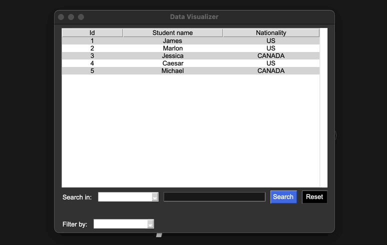
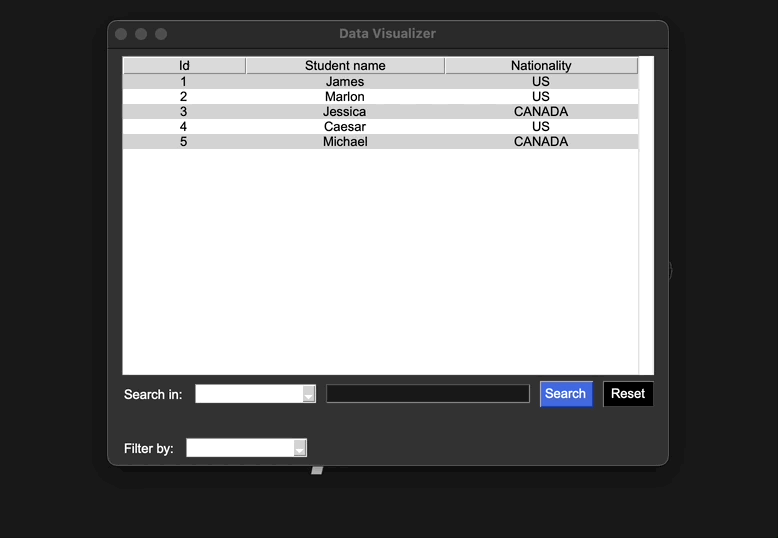
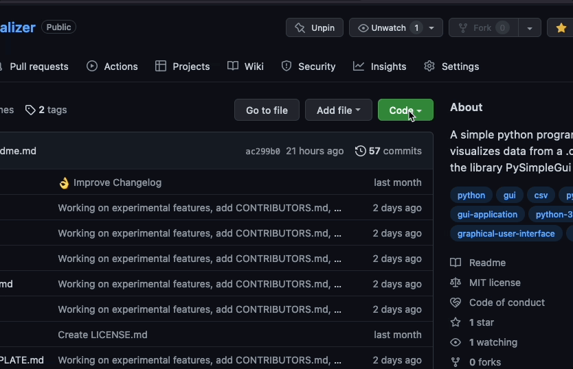

<h4 align='center'>
      
    <br>
    <br>
    V. 0.1.1
</h4>

<br>

<h1> Project Description</h1>

A python program that visualizes data from a `.csv` file. It uses the [PySimpleGui](https://github.com/PySimpleGUI) gui library for its GUI, and [PyDub](https://github.com/jiaaro/pydub/) for some simple error audio handling. 

At the moment, this program can only read data from `.csv` files, but in the future I plan on adding support for other filetypes, and an option to connect to a SQL or MongoDb database.

<h1> Table of Contents </h1>

- [Features](#features)
  - [Display data](#display-data)
  - [Search data](#search-data)
  - [Filter data](#filter-data)
- [Installation](#installation)
    - [Install from source](#install-from-source)
- [Dependencies](#dependencies)
  - [Pip installation (optional)](#pip-installation-optional)
- [File Support](#file-support)
- [Header bug](#header-bug)
- [Changelog](#changelog)
- [License](#license)

# Features

## Display data

<div align="center">

</div>
<br>

## Search data

<div align="center">

</div>

<br>

## Filter data

<div align="center">

</div>

<br>

---

# Installation

If you want to test the program yourself, I recommend you visit the page [mockaroo](https://mockaroo.com/) to get some sample data in `.csv` format.

### Install from source

1. Clone the repo into your local machine:

<div align="center">

</div>

<br>

2. Open the downloaded repo folder and run the `__main__.py` file with the following command:

    ```python
    python3 -m __main__.py
    ```

---

# Dependencies

Data visualizer requires the PySimpleGui and PyDub libraries to run. You can install them with pip using the following commands:

```shell
pip install PySimpleGUI
```

```shell
pip install pydub
```

In the case that you don't have pip, scroll down a little bit to see how to install it.

---

## Pip installation (optional)

Don't have pip? You can install it like this:

<h4>Linux & MacOs</h4>

```bash
python3 -m ensurepip
```

<h4>Windows</h4>

```bash
py -m ensurepip
```
Please note that the installation of pip in windows can sometimes be... _complicated_. If you are having problems making pip work, I recommend you this [video guide](https://youtu.be/c_qNC1lL4qA) on how to install it.

# File Support

Data visualizer supports the following types of files:

| File Type | Support |
| --------- | ------- |
| .csv | ✅ |
| .json | ❌ |
| SQL | 📅 |
| Mongodb | ❌ |

Keywords: `✅ Yes`, `❌ No`, `📅 work in progress`

# Header bug

Currently, there's a bug where the first row of header-less `.csv` files appear messed up. The nature of bug makes it pretty difficult to fix, but with time, I think I'll be able to get it done. So, keep that in mind while working with files wihout a proper header.

# Changelog

[❯ Read the changelog here →](CHANGELOG.md) 📄

# License

MIT License

[❯ Read the license here →](LICENSE.md) 🔏
