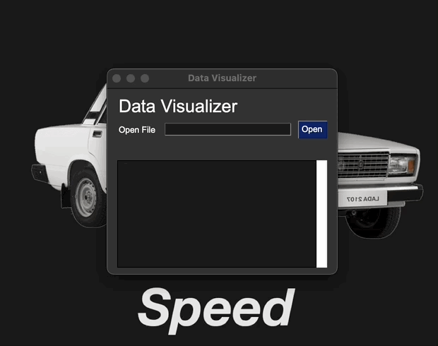
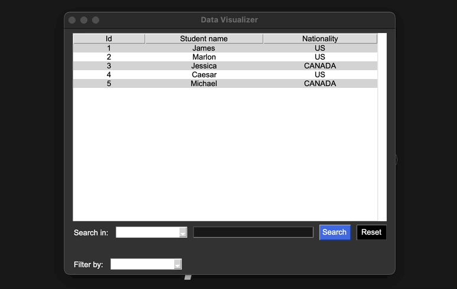
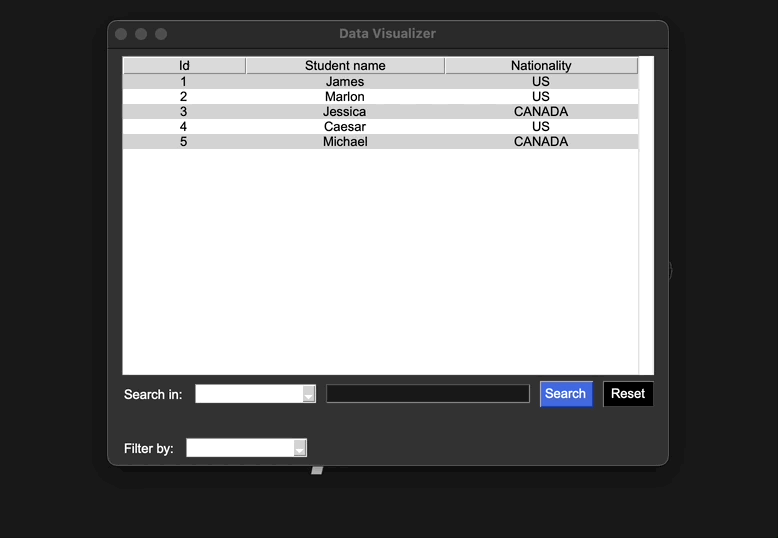
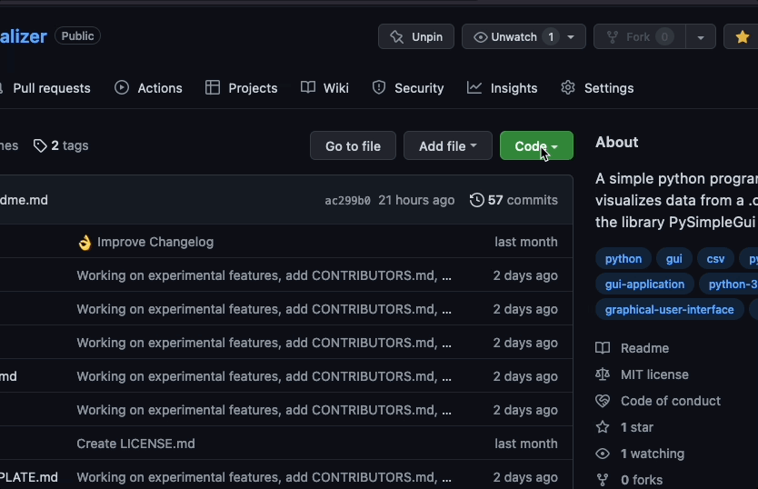

<h4 align='center'>
      
    <br>
    <br>
    V. 0.1.8
</h4>

<br>

<h1> Project Description</h1>

A python program that visualizes data from a `.csv` file. It uses the [PySimpleGui](https://github.com/PySimpleGUI) python library for its GUI.

At the moment, this program can only read data from `.csv` files, but in the future I plan on adding support for other filetypes, and an option to connect to a SQL or a MongoDb database.

<h1> Table of Contents </h1>

- [Features](#features)
  - [Display data](#display-data)
  - [Search data](#search-data)
  - [Filter data](#filter-data)
- [Installation](#installation)
    - [Using pip](#using-pip)
    - [From source](#from-source)
- [Usage](#usage)
  - [Pip](#pip)
  - [Manually](#manually)
- [Dependencies](#dependencies)
  - [PySimpleGui](#pysimplegui)
    - [Tkinter](#tkinter)
  - [Pip installation](#pip-installation)
- [File Support](#file-support)
- [Header bug](#header-bug)
  - [Bug example](#bug-example)
- [License](#license)
    - [PySimpleGui](#pysimplegui-1)

# Features

If you want to test the program yourself, I recommend you visit the page [mockaroo](https://mockaroo.com/) to get some sample data in `.csv` format.

## Display data

<div align="center">

</div>
<br>

## Search data

<div align="center">

</div>

<br>

## Filter data

<div align="center">

</div>

<br>

---

# Installation

### Using pip

Data visualizer can be installed with pip, along with all the program dependencies in the case they aren't installed. To do so, run the follow command:

```shell
pip install data-visualizer
```

### From source

On the other hand, if you want to, you can also download the program from the repo. If you want to do so, follow these steps to do so.

1. Clone the repo into your local machine:

<div align="center">

</div>

<br>

  2. Open the cloned folder and run the `"data_visualizer"` folder as a module with the following command:

  ```shell
  python3 -m data_visualizer
  ```

---

# Usage

There are several ways in which you can open the program.

## Pip

If Data Visualizer was installed with pip, you can run the program in the terminal by simple writing `data-visualizer` in the terminal. The program will then open.

## Manually

Another way you can run the program is by opening either the module folder installed by pip, or the cloned folder from the repo. Then, once inside the folder, simply run the `data_visualizer` folder as a python module with the following command:

```shell
python3 -m data_visualizer
```

# Dependencies

## PySimpleGui

By default, Data Visualizer's `setup.py` file was setup in a way that automatically downloads all the packages the program uses and depends of. However, if for some reason you want to install them yourself, Data Visualizer requires the PySimpleGui library to work.

You can install them with pip using the following commands:

```shell
pip install PySimpleGUI
```

In the case that you don't have pip, scroll down to the [Pip Instalation](#pip-installation) section to see how to install it.

---

### Tkinter
Data Visualizer is made using the PySimpleGui library, which uses Tkinter under the hood. So, it is very important to have Tkinter already setup to your Python version for Data Visualizer to work.

If you don't have Tkinter already with your Python configuration, you will need to do that first.

- Windows: [Follow this video guide](https://www.youtube.com/watch?v=O2PzLeiBEuE).
- MacOs (Using Homebrew): `brew install python-tk`
- Linux (Ubuntu): `sudo apt-get update && sudo apt-get install python3-tk`

---

## Pip installation

Don't have pip? You can install it like this:

<h4>Linux & MacOs</h4>

```shell
python3 -m ensurepip
```

<h4>Windows</h4>

```shell
py -m ensurepip
```
Please note that the installation of pip in windows can sometimes be... _complicated_. If you are having problems making pip work, I recommend you this [video guide](https://youtu.be/c_qNC1lL4qA) on how to install it.

# File Support

Data visualizer supports the following types of files:

| File Type | Support |
| --------- | ------- |
| .csv | ✅ |
| .json | ❌ |
| SQL | 📅 |
| Mongodb | ❌ |

Keywords: `✅ Yes`, `❌ No`, `📅 work in progress`

# Header bug

Currently, there's a bug where the first row of header-less `.csv` files gets confused for the file's headers. This happens because Data Visualizer always takes the first row of a .csv file that comes with pre-defined headers, and uses it as the headers of the file. The usefulness of this feature can be seen with files that has its data pre-categorize in the forms of these headers. However, for files that don't do this , this feature becomes a problem.

The nature of this bug makes it pretty difficult to fix, but with time, I think I'll be able to get it done. So, keep that in mind while working with files wihout a proper header for the time being.

## Bug example

Note: The files used in this example were taken from [mockaroo](https://mockaroo.com/).

<hr>

<div align='center'>

<p>File with pre-defined headers</p>


<hr>

<p>File without pre-defined headers</p>

</div>

<!-- # Changelog

[❯ Read the changelog here →](changelog.md) 📄 -->

# License

This project makes use of the MIT license. To read more about it, you can check it out [here](LICENSE.md).

### PySimpleGui

This project makes uses of the PySimpleGui python library, which makes use of the LGPL-3.0 license. Read more about this license in the project repo [here](https://github.com/PySimpleGUI/PySimpleGUI/blob/master/license.txt).