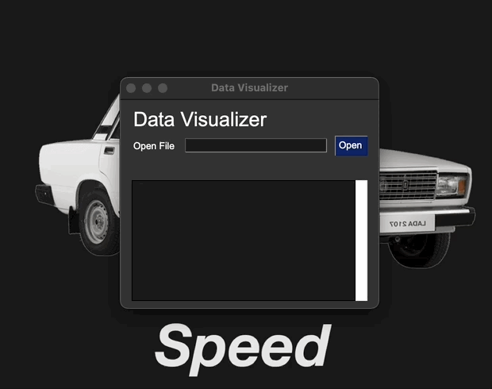

<h4 align='center'>
    <a href="https://github.com/AsleyR/data_visualizer">
        
    </a>
    <br>
    <br>
    V. 0.1.1
</h4>

<br>

# Project Description
A simple python program that let you visualizes data from a `.csv` file. It uses the [PySimpleGui](https://github.com/PySimpleGUI) for its GUI. 

At the moment, this program can only read data from `.csv` files, but in the future I plan on adding support for other types of files, and option to connect to a SQL database.

# Table of Contents

- [Project Description](#project-description)
- [Table of Contents](#table-of-contents)
- [Features](#features)
  - [Display data](#display-data)
  - [Search data](#search-data)
  - [Filter data](#filter-data)
- [Dependencies](#dependencies)
  - [Pip installation (optional)](#pip-installation-optional)
  - [File Support](#file-support)
- [Changelog](#changelog)
- [License](#license)

# Features

## Display data


<br>

## Search data


<br>

## Filter data


<br>

# Dependencies

Data visualizer requires the PySimpleGui library to run. You can install it with pip using the following command:

```shell
pip install PySimpleGUI
```

In the case that you don't have pip, scroll down a little bit to see how to install it.

---

## Pip installation (optional)

Don't have pip? You can install it like this:

<h4>Linux & MacOs</h4>

```bash
python3 -m ensurepip
```

<h4>Windows</h4>

```bash
py -m ensurepip
```
Please note that the installation of pip in windows can sometimes be... _complicated_. If you are having problems making pip work, I recommend you [this video guide](https://youtu.be/c_qNC1lL4qA) on how to install it.

## File Support

Data visualizer supports the following types of files:

| File Type | Support |
| --------- | ------- |
| .csv | ✅ |
| .json | ❌ |
| SQL | 📅 |
| Mongodb | ❌ |

Keywords: `✅ Yes`, `❌ No`, `📅 In the future`

# Changelog

[❯ Read the changelog here →](CHANGELOG.md) 📄

# License

MIT License

[❯ Read the license here →](LICENSE.md) 🔏
